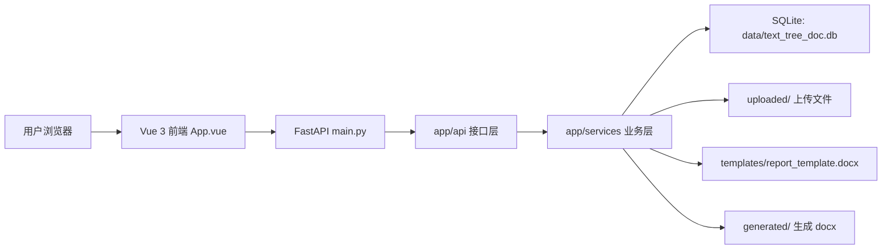
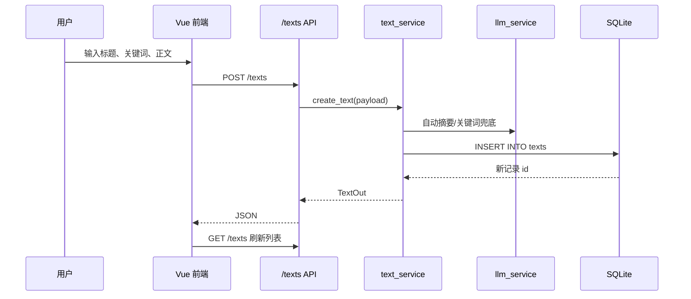
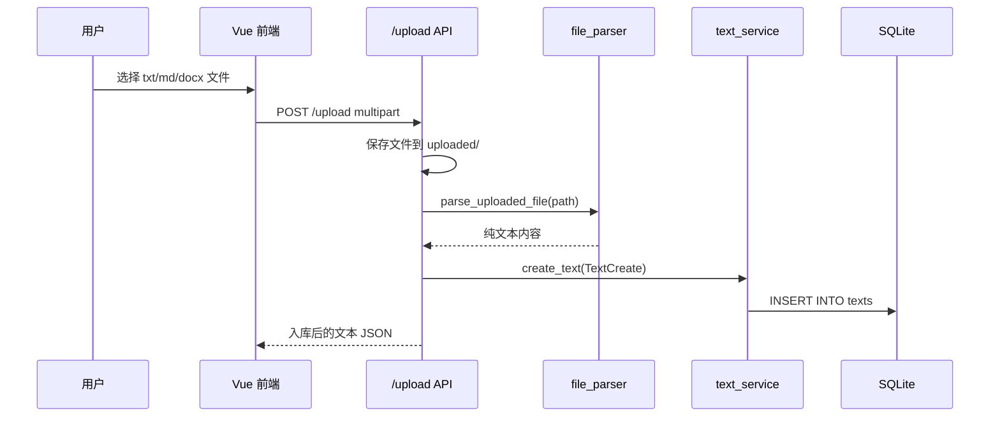
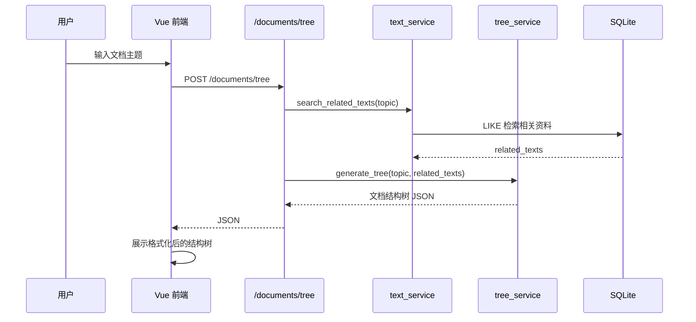
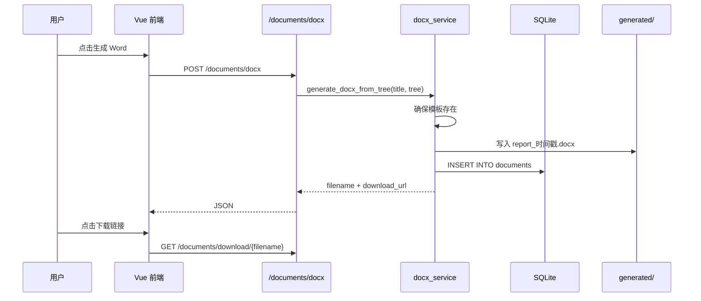

# TextTreeDoc 项目架构速览

本文用于快速理解 TextTreeDoc 的整体架构、核心组件和运行原理。项目本质上是一个“文本资料库 -> 文档结构树 -> Word 文档”的自动生成系统：用户可以手动录入资料或上传文件，后端把资料保存到 SQLite；用户输入文档主题后，系统从文本库中检索相关资料，生成结构化 JSON；最后根据该 JSON 生成 `.docx` 文件并提供下载。

## 1. 技术栈

- 后端：Python、FastAPI、SQLite
- 文档生成：docxtpl、python-docx
- 前端：Vite、Vue 3
- 数据存储：本地 SQLite 数据库
- 文件目录：上传文件、生成文件、Word 模板都保存在项目本地目录

## 2. 顶层目录结构

```text
TextTreeDoc/
├── main.py                 # FastAPI 应用入口
├── app/
│   ├── api/                # HTTP 接口层
│   ├── core/               # 配置、数据库初始化
│   ├── models/             # Pydantic 请求/响应模型
│   └── services/           # 业务逻辑层
├── frontend/
│   ├── index.html
│   └── src/
│       ├── App.vue         # 前端主界面和交互逻辑
│       ├── main.js         # Vue 挂载入口
│       └── style.css       # 页面样式
├── docs/                   # 原有项目文档
├── data/                   # 运行后生成，存放 SQLite 数据库
├── uploaded/               # 运行后生成，存放上传文件
├── generated/              # 运行后生成，存放生成的 Word 文件
├── templates/              # 运行后生成，存放 Word 模板
├── package.json            # 前端依赖与脚本
├── requirements.txt        # 后端依赖
└── vite.config.js          # Vite 配置
```

其中 `data/`、`uploaded/`、`generated/`、`templates/` 不一定一开始存在，后端启动或调用相关功能时会自动创建。

## 3. 整体架构



项目采用比较清晰的后端分层：

- `main.py` 创建 FastAPI 应用，注册跨域、路由和静态资源。
- `app/api/` 只负责接收 HTTP 请求、做少量参数/异常处理，然后调用服务层。
- `app/services/` 实现文本入库、文件解析、关键词检索、结构树生成、Word 生成等业务逻辑。
- `app/core/` 负责路径配置、运行目录创建、数据库连接和初始化。
- `app/models/` 定义接口使用的 Pydantic 数据模型。

## 4. 后端入口 main.py

`main.py` 是整个后端应用的启动入口，主要做四件事：

1. 创建 `FastAPI` 实例。
2. 配置 CORS，允许 Vite 开发服务器访问后端。
3. 注册文本、上传、文档三个路由模块。
4. 启动时初始化 SQLite 数据库。

关键代码：

```python
app = FastAPI(title="TextTreeDoc", description="基于文本库的文档结构树与 Word 自动生成系统")

app.add_middleware(
    CORSMiddleware,
    allow_origins=["http://127.0.0.1:5173", "http://localhost:5173"],
    allow_credentials=True,
    allow_methods=["*"],
    allow_headers=["*"],
)

app.include_router(text_api.router)
app.include_router(upload_api.router)
app.include_router(document_api.router)
```

启动事件中调用 `init_db()`：

```python
@app.on_event("startup")
def on_startup() -> None:
    init_db()
```

因此，只要运行：

```bash
uvicorn main:app --reload
```

后端就会自动准备数据库和运行目录。

## 5. 配置与数据库

### 5.1 路径配置

`app/core/config.py` 统一管理运行路径：

```python
PROJECT_ROOT = Path(__file__).resolve().parents[2]
DATA_DIR = PROJECT_ROOT / "data"
UPLOAD_DIR = PROJECT_ROOT / "uploaded"
GENERATED_DIR = PROJECT_ROOT / "generated"
TEMPLATE_DIR = PROJECT_ROOT / "templates"
FRONTEND_DIST_DIR = PROJECT_ROOT / "frontend" / "dist"

DB_PATH = DATA_DIR / "text_tree_doc.db"
REPORT_TEMPLATE_PATH = TEMPLATE_DIR / "report_template.docx"
```

`ensure_runtime_dirs()` 会确保这些目录存在：

```python
for directory in (DATA_DIR, UPLOAD_DIR, GENERATED_DIR, TEMPLATE_DIR):
    directory.mkdir(parents=True, exist_ok=True)
```

### 5.2 SQLite 表结构

`app/core/database.py` 中的 `init_db()` 会创建两张表：

- `texts`：存储文本资料，是结构树生成的数据来源。
- `documents`：记录生成过的文档、结构树 JSON 和 docx 路径。

核心表结构：

```sql
CREATE TABLE IF NOT EXISTS texts (
    id INTEGER PRIMARY KEY AUTOINCREMENT,
    title TEXT NOT NULL,
    summary TEXT,
    content TEXT NOT NULL,
    keywords TEXT,
    source_type TEXT,
    source_url TEXT,
    created_at TEXT,
    created_by TEXT
)
```

```sql
CREATE TABLE IF NOT EXISTS documents (
    id INTEGER PRIMARY KEY AUTOINCREMENT,
    title TEXT NOT NULL,
    topic TEXT,
    tree_json TEXT,
    docx_path TEXT,
    created_at TEXT,
    created_by TEXT
)
```

如果 `texts` 表为空，项目会自动插入几条课程演示资料，因此首次启动后就能直接演示生成流程。

## 6. API 层组件

### 6.1 文本库接口 app/api/text_api.py

路由前缀：`/texts`

主要接口：

- `POST /texts`：新增文本资料
- `GET /texts`：查询文本资料列表，可用 `keyword` 搜索
- `GET /texts/{text_id}`：查看文本详情
- `DELETE /texts/{text_id}`：删除文本资料

接口层本身不直接操作数据库，而是调用 `text_service`：

```python
@router.post("", response_model=TextOut)
def create_text(payload: TextCreate) -> dict:
    return text_service.create_text(payload)
```

### 6.2 上传接口 app/api/upload_api.py

路由前缀：`/upload`

上传接口只允许 `.txt`、`.md`、`.docx`：

```python
suffix = Path(file.filename or "").suffix.lower()
if suffix not in {".txt", ".md", ".docx"}:
    raise HTTPException(status_code=400, detail="仅支持 .txt、.md、.docx 文件")
```

运行流程是：

1. 保存上传文件到 `uploaded/`。
2. 调用 `parse_uploaded_file()` 解析纯文本。
3. 把解析结果封装成 `TextCreate`。
4. 调用 `create_text()` 入库。

### 6.3 文档接口 app/api/document_api.py

路由前缀：`/documents`

主要接口：

- `POST /documents/tree`：根据主题生成文档结构树 JSON
- `POST /documents/docx`：根据结构树生成 Word 文件
- `GET /documents/download/{filename}`：下载生成的 Word 文件

结构树生成接口的核心逻辑：

```python
related_texts = search_related_texts(request.topic)
return generate_tree(request.topic, related_texts)
```

Word 生成接口的核心逻辑：

```python
return generate_docx_from_tree(request.title, request.tree)
```

下载接口使用 `resolve()` 和父目录检查，避免用户通过路径穿越下载 `generated/` 外面的文件：

```python
path = (GENERATED_DIR / filename).resolve()
generated_root = GENERATED_DIR.resolve()
if generated_root not in path.parents or not path.exists():
    raise HTTPException(status_code=404, detail="文件不存在")
```

## 7. 数据模型 app/models/schemas.py

该文件定义接口请求和响应的数据结构。

新增文本请求：

```python
class TextCreate(BaseModel):
    title: str = Field(..., min_length=1)
    content: str = Field(..., min_length=1)
    summary: str | None = None
    keywords: str | None = None
    source_type: str = "manual"
    source_url: str | None = ""
    created_by: str | None = "anonymous"
```

生成结构树请求：

```python
class TreeRequest(BaseModel):
    topic: str = Field(..., min_length=1)
    use_llm: bool = False
```

生成 Word 请求：

```python
class DocxRequest(BaseModel):
    title: str
    tree: dict[str, Any]
```

注意：`TreeRequest` 中虽然有 `use_llm` 字段，但当前 `document_api.py` 没有真正使用它，结构树生成始终走本地规则。

## 8. 业务服务层

### 8.1 文本服务 app/services/text_service.py

这个模块负责文本资料的增删查和主题检索。

新增文本时，如果前端没有传摘要或关键词，后端会自动生成：

```python
summary = payload.summary or generate_summary(payload.content)
keywords = payload.keywords or ",".join(generate_keywords(payload.title, payload.content))
```

然后写入 `texts` 表：

```python
INSERT INTO texts (title, summary, content, keywords, source_type, source_url, created_at, created_by)
VALUES (?, ?, ?, ?, ?, ?, ?, ?)
```

主题检索使用 SQLite `LIKE`，匹配标题、关键词、摘要和正文：

```python
clauses.append("(title LIKE ? OR keywords LIKE ? OR summary LIKE ? OR content LIKE ?)")
```

如果主题没有命中任何资料，会返回最近的资料作为演示兜底：

```python
if not rows:
    rows = connection.execute("SELECT * FROM texts ORDER BY id DESC LIMIT ?", (limit,)).fetchall()
```

中文主题没有天然空格，所以 `_split_topic_keywords()` 会额外生成 2 到 4 字的滑动窗口，例如“开源许可证分析报告”会拆出“开源许可”“许可证”“分析”等片段，用来提升检索命中率。

### 8.2 文件解析 app/services/file_parser.py

上传文件解析逻辑很直接：

- `.txt` / `.md`：按 UTF-8 文本读取。
- `.docx`：使用 `python-docx` 提取段落文本。

关键代码：

```python
if suffix in {".txt", ".md"}:
    return path.read_text(encoding="utf-8", errors="ignore")
if suffix == ".docx":
    document = Document(path)
    return "\n".join(paragraph.text for paragraph in document.paragraphs if paragraph.text.strip())
```

### 8.3 本地 LLM 兜底 app/services/llm_service.py

当前版本没有真正调用远程大模型，只预留了环境变量判断：

```python
def llm_available() -> bool:
    return bool(os.getenv("LLM_API_KEY"))
```

摘要生成是截取清洗后的前 160 个字符：

```python
cleaned = " ".join(content.split())
return cleaned[:max_length]
```

关键词生成使用正则提取中文词块和英文 token，再用词频排序：

```python
tokens = re.findall(r"[\u4e00-\u9fa5]{2,}|[A-Za-z][A-Za-z0-9_-]{2,}", text)
counter = Counter(token for token in tokens if token.lower() not in stop_words)
return [word for word, _ in counter.most_common(limit)]
```

### 8.4 结构树生成 app/services/tree_service.py

`generate_tree(topic, related_texts)` 把主题和相关资料转换成固定结构的 JSON：

```python
return {
    "title": topic,
    "sections": [
        {
            "heading": "1. 项目背景",
            "content": f"{topic} 的文档创建需要围绕主题资料进行整理。{snippets[0]}",
            "children": [],
        },
        ...
    ],
}
```

结构树的节点字段主要有：

- `heading`：章节标题
- `content`：章节正文
- `children`：子章节
- `blocks`：额外内容块，目前主要支持表格

表格块示例：

```python
{
    "type": "table",
    "headers": ["资料标题", "关键词", "来源"],
    "rows": [
        [item.get("title", ""), item.get("keywords", ""), item.get("source_type", "") or "manual"]
        for item in related_texts[:5]
    ],
}
```

所以前端看到的结构树 JSON，不只是展示用，也会直接作为 Word 生成的输入。

### 8.5 Word 生成 app/services/docx_service.py

Word 生成分两步：

1. 用 `docxtpl` 渲染基础模板，写入标题和生成时间。
2. 用 `python-docx` 继续追加结构树中的章节、正文和表格。

如果模板不存在，`ensure_report_template()` 会自动创建最小模板：

```python
document = Document()
document.add_heading("{{ title }}", level=0)
document.add_paragraph("生成时间：{{ generated_at }}")
document.add_paragraph("本报告由 TextTreeDoc 根据文本库资料和文档结构树自动生成。")
document.add_page_break()
document.save(REPORT_TEMPLATE_PATH)
```

生成 docx 的主流程：

```python
template = DocxTemplate(REPORT_TEMPLATE_PATH)
template.render({"title": title, "generated_at": datetime.now().strftime("%Y-%m-%d %H:%M:%S")})
template.save(output_path)

document = Document(output_path)
for section in tree.get("sections", []):
    _append_section(document, section, level=1)
document.save(output_path)
```

`_append_section()` 递归处理多级章节：

```python
if heading:
    document.add_heading(heading, level=min(level, 4))
if content:
    document.add_paragraph(content)
for block in section.get("blocks", []):
    _append_block(document, block)
for child in section.get("children", []):
    _append_section(document, child, level=level + 1)
```

`_append_block()` 当前支持 `table`：

```python
table = document.add_table(rows=1, cols=len(headers))
table.style = "Table Grid"
```

最后 `_save_document_record()` 会把生成记录保存到 `documents` 表，包含标题、主题、结构树 JSON、生成文件路径和创建时间。

## 9. 前端组件 frontend/src/App.vue

前端目前是单文件主组件，没有拆分多个子组件。它承担了页面状态、接口调用和模板渲染。

### 9.1 API 地址选择

开发环境默认前端跑在 `5173`，后端跑在 `8000`：

```js
const API_BASE =
  import.meta.env.VITE_API_BASE ||
  (window.location.port === '5173' ? 'http://127.0.0.1:8000' : window.location.origin)
```

如果前端被构建后由 FastAPI 托管，则 `API_BASE` 会使用当前站点 origin。

### 9.2 页面状态

核心状态：

```js
const texts = ref([])
const keyword = ref('')
const newText = ref({ title: '', keywords: '', content: '' })
const topic = ref('开源许可证分析报告')
const currentTree = ref(null)
const selectedText = ref(null)
const downloadUrl = ref('')
const notice = ref('')
const loading = ref(false)
const uploadFile = ref(null)
```

`treeJson` 是根据 `currentTree` 计算出来的展示字符串：

```js
const treeJson = computed(() => (currentTree.value ? JSON.stringify(currentTree.value, null, 2) : ''))
```

### 9.3 通用请求函数

前端把 `fetch` 包了一层 `apiFetch()`，统一处理错误：

```js
async function apiFetch(path, options = {}) {
  const response = await fetch(`${API_BASE}${path}`, options)
  if (!response.ok) {
    const error = await response.json().catch(() => ({ detail: '请求失败' }))
    throw new Error(error.detail || '请求失败')
  }
  return response.json()
}
```

### 9.4 用户操作流程

页面主要分四块：

- 左侧文本库：搜索、刷新、选择、删除资料。
- 新增资料：输入标题、关键词、正文后入库。
- 文件上传：选择 `.txt` / `.md` / `.docx` 并解析入库。
- 生成文档：输入主题，生成结构树，再生成 Word。

生成结构树时调用：

```js
currentTree.value = await apiFetch('/documents/tree', {
  method: 'POST',
  headers: { 'Content-Type': 'application/json' },
  body: JSON.stringify({ topic: topic.value.trim(), use_llm: false }),
})
```

生成 Word 时调用：

```js
const result = await apiFetch('/documents/docx', {
  method: 'POST',
  headers: { 'Content-Type': 'application/json' },
  body: JSON.stringify({ title: currentTree.value.title, tree: currentTree.value }),
})
downloadUrl.value = `${API_BASE}${result.download_url}`
```

组件挂载后自动加载文本库：

```js
onMounted(loadTexts)
```

## 10. 核心业务流程

### 10.1 手动新增文本



### 10.2 上传文件入库



### 10.3 生成结构树



### 10.4 生成并下载 Word



## 11. 结构树数据格式

后端生成的结构树大致如下：

```json
{
  "title": "开源许可证分析报告",
  "sections": [
    {
      "heading": "1. 项目背景",
      "content": "章节正文",
      "children": []
    },
    {
      "heading": "3. 核心内容整理",
      "content": "章节正文",
      "children": [],
      "blocks": [
        {
          "type": "table",
          "headers": ["资料标题", "关键词", "来源"],
          "rows": [
            ["开源许可证概述", "开源,许可证,MIT,GPL,Apache", "seed"]
          ]
        }
      ]
    }
  ]
}
```

这个 JSON 是项目最关键的中间格式：

- 前端用它展示结构树。
- 后端用它生成 Word。
- `documents.tree_json` 会保存它，便于后续追溯生成记录。

## 12. 接口总览

| 方法 | 路径 | 作用 |
| --- | --- | --- |
| GET | `/health` | 健康检查 |
| GET | `/texts` | 获取文本列表，可带 `keyword` |
| POST | `/texts` | 新增文本资料 |
| GET | `/texts/{text_id}` | 获取单条文本详情 |
| DELETE | `/texts/{text_id}` | 删除文本资料 |
| POST | `/upload` | 上传并解析 `.txt` / `.md` / `.docx` |
| POST | `/documents/tree` | 根据主题生成结构树 |
| POST | `/documents/docx` | 根据结构树生成 Word |
| GET | `/documents/download/{filename}` | 下载生成的 Word |

## 13. 运行方式

后端：

```bash
python -m venv .venv
.venv\Scripts\activate
pip install -r requirements.txt
uvicorn main:app --reload
```

前端：

```bash
npm install
npm run dev
```

访问：

```text
前端：http://127.0.0.1:5173
后端接口文档：http://127.0.0.1:8000/docs
```

如果执行 `npm run build`，前端会构建到 `frontend/dist`。`main.py` 检测到该目录存在时，会用 FastAPI 托管构建后的静态页面：

```python
if Path(FRONTEND_DIST_DIR).exists():
    app.mount("/", StaticFiles(directory=FRONTEND_DIST_DIR, html=True), name="frontend")
```

## 14. 当前实现特点与可扩展点

当前实现偏课程演示型，优点是结构简单、依赖少、能离线跑通完整流程。

可以扩展的方向：

- 真正接入 LLM：`llm_service.py` 已经预留 `LLM_API_KEY` 判断，但结构树生成目前仍是固定规则。
- 增强检索：当前是 SQLite `LIKE` 检索，可改成全文检索、向量检索或 BM25。
- 拆分前端组件：`App.vue` 目前包含所有交互和页面模板，可拆成文本库、资料表单、上传区、文档生成区等组件。
- 丰富结构树 block：`docx_service.py` 目前主要支持 `table`，可以扩展图片、列表、代码块等类型。
- 增加文档记录查询接口：数据库已有 `documents` 表，但当前没有对应的列表/详情接口。

## 15. 一句话理解项目

TextTreeDoc 的核心是把非结构化文本资料统一存进 SQLite，再用一个固定 JSON 结构树作为中间层，让前端展示和后端 Word 生成共享同一套数据格式。
